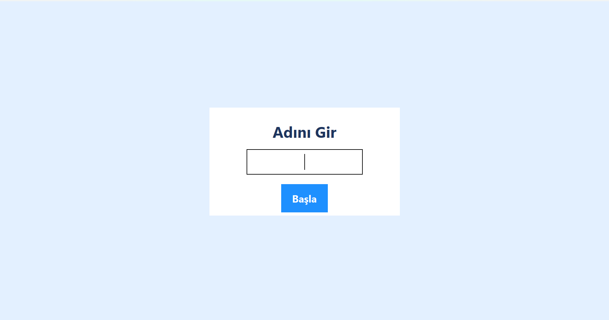
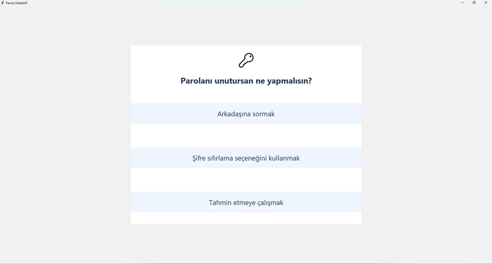

# 🛡️ Siber Kahraman Standı 2025

Çocuklara siber güvenlik bilinci kazandırmak amacıyla geliştirilen interaktif bir stand oyunudur. Modern tasarımı, eğitici içeriği ve eğlenceli tam ekran deneyimiyle dikkat çeker.

---

### 🔤 Giriş Ekranı – İsim Yazma  


### ❓ Örnek Soru Ekranı  


---
## 🎯 Özellikler

- ✅ **5 farklı istasyon**:  
  - Parola Dedektifi  
  - Kamera Canavarı  
  - Bilgi Avcısı  
  - Uygulama Dedektifi  
  - Wi-Fi Tehlikesi

- 🔀 Her istasyonda **rastgele 3 soru** (Toplamda 21 soruluk havuz)
- ❌ **Yanlış cevapta oyun biter** (joker veya tekrar hakkı yok)
- 🏅 **Puan ve rozet sistemi**:  
  - Altın  
  - Gümüş  
  - Bronz  
  - Teşekkür

- 🏆 **Skor kaydı ve En İyi 10 Skor Tablosu**
- 📄 **PDF Sertifika** otomatik oluşturulur (Türkçe karakter destekli)
- 🎨 Modern UI:  
  - Renkli gradient arka plan  
  - Card/kutu stili  
  - Büyük oval butonlar  
  - İkonlar  
  - Animasyonlar  
  - Yıldız/rozet efektleri

- 🎉 **Sonuçta konfeti ve yıldız yağmuru animasyonu**
- 🖥️ Tüm pencereler **tam ekran** olarak açılır

---
## Kurulum
1. **Python 3.13** yüklü olmalı. (En sorunsuz deneyim için önerilen sürüm)
2. Terminalde şunu çalıştır:
   ```bash
   C:\Python313\python.exe -m pip install reportlab
   ```
3. Proje klasöründe `DejaVuSans.ttf` dosyası bulunmalı (Türkçe PDF için).
---
## Çalıştırma
Oyunu başlatmak için terminalde:
```bash
C:\Python313\python.exe main.py
```
Başka bir Python ile çalıştırırsanız PDF ve bazı özellikler çalışmayabilir.
---
## Kullanım
- Oyunu başlatınca tam ekranda isim girilir.
- Her istasyonda 3 soru gelir, yanlış cevapta oyun hemen biter ve "Kaybettin" ekranı çıkar.
- Tüm görevler bitince puan, rozet, sertifika ve skor tablosu gösterilir.
- Oyun sonunda PDF sertifika otomatik oluşturulur ve açılır.
- Oyun tamamen çevrimdışıdır, internet gerekmez.

## Notlar
- Çocuklar için güvenli ve eğlenceli olacak şekilde tasarlanmıştır.
- Her türlü geliştirme ve özelleştirme için kodu düzenleyebilirsiniz. 
